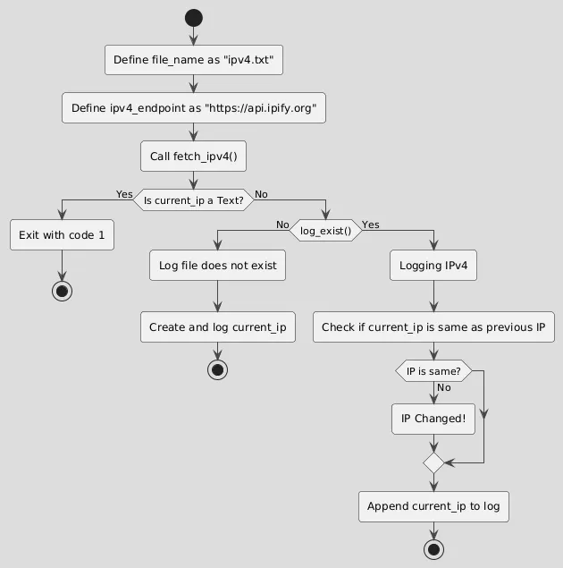

# helloAmber

## Flowchart


## Usage
### Execute the Script
To execute the script using Amber, run:
```bash
amber main.ab
```
### Execute the Script
To compile the script into main.sh, run:
```bash
amber main.ab main.sh
```