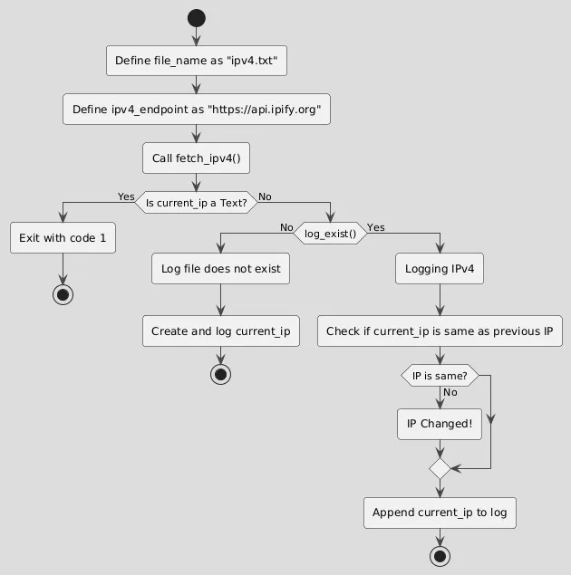

# helloAmber

this asset for my arcticle : https://medium.com/scb-digital/สวัสดี-amber-lang-ของดีสาย-unix-ที่จะทำให้-bash-ไม่น่าเบื่ออีกต่อไป-a4c672558b47

## Flowchart


## Usage
### Execute the Script
To execute the script using Amber, run:
```bash
amber main.ab
```
### Execute the Script
To compile the script into main.sh, run:
```bash
amber main.ab main.sh
```
